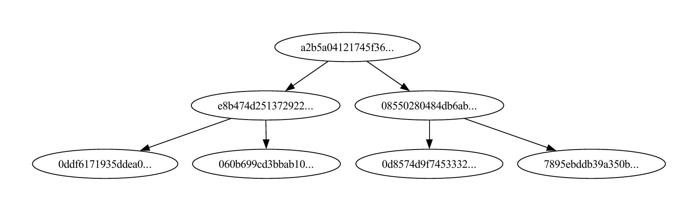

# Merkle Tree Implementation

This project provides a Python implementation of a Merkle Tree, a fundamental data structure used in cryptography and blockchain technologies. It includes functionalities for constructing the tree, generating Merkle proofs, and verifying the inclusion of data within the tree.

## Project Description



## Features

- Construction of a Merkle Tree from a list of data elements.
- Generation of Merkle proofs to verify the inclusion of an element.
- Verification of Merkle proofs to ensure data integrity.
- Visualization of the Merkle Tree structure.

### Create a Virtual Environment
Create a virtual environment in the directory `venv`:
```bash
python -m venv venv
```

### Activate the Virtual Environment

- **On Linux and macOS**:
    ```bash
    source venv/bin/activate
    ```
- **On Windows**:
    ```cmd
    venv\Scripts\activate
    ```

### Install Dependencies
Now you can safely install packages with pip. Specifically, you'll need `graphviz` to generate visualizations:
```bash
pip install graphviz
```

## Run the tests
1. Make sure you have python installed.
2. For merkle_tree tests
    ```
    python -m unittest test_merkle_tree.py
    ```
    in command line.
3. Will create a PDF file named `merkle_tree_visualization.pdf` in your current directory, containing the visualization of the Merkle Tree.


## module merkle_tree.py
- [x] ** create a merkle tree
- [x] ** calculate proof-of-inclusion for a value at an index
- [x] ** verify proof-of-inclusion given the value, the index, the proof and the root
- [ ] **add a value to the merkle tree [in progress]
- [ ] **update a value of the merkle tree [in progress]
- [ ] **print all levels of the merkle tree

## Author

- Danai Balla (Contact: email) | [linkedin](https://www.linkedin.com/in/danai-balla-81b649170/)


## Contributors

- Paschalis Moschogiannis (Contact: [pmoschogiannis@uth.gr](mailto:pmoschogiannis@uth.gr))

## License

This project is licensed under the [GNU General Public License Version 3 (GPLv3)](LICENSE).
